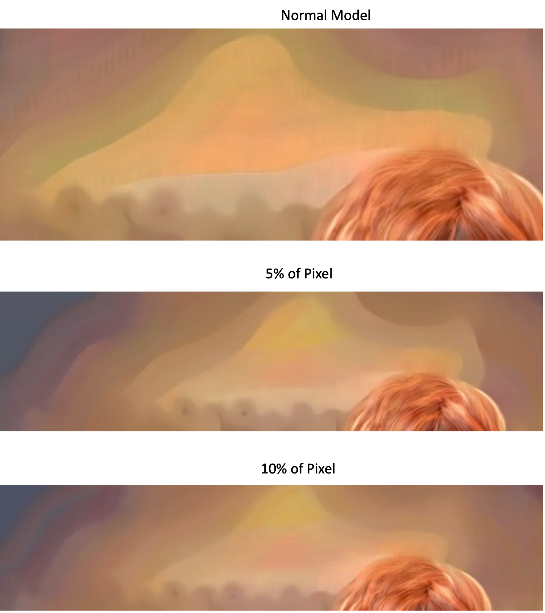

# Exploring Image Recovery Hybrid Bit Depth Pixel Layout

1. ## Overview
Our technique enhances low-bit-depth images by recovering detailed information from quantized inputs. Using Bit Depth Expansion combined with a convolutional neural network, we replace pixel values to improve image clarity and maintain crucial details, benefiting applications like surveillance and medical imaging.

## Model's Output

**Model's recovering images from low bit images with different amount of pixel value replaced from original image**




2. ## Installation

Our code is developed and tested on the following environment

- **Operating System:** Ubuntu 22.04
- **Python Version:** 3.6
- **Pytorch Version:** 1.10.0
- **CUDA Version:** 12(NVIDIA RTX3090 12GB) we use 4 gpu for parallel processing

### Environmental Setup
We recommend using [conda](https://www.anaconda.com/download) for setting up the environment:

a. **Clone the repository** (if you haven't already)
``` bash
git clone https://github.com/Adigo45/Image-Recovery
cd Image-Recovery
```
b. **Create Conda Environment**
```conda
conda env create --file environment.yaml
```
c. **Activate the Conda Environment**
```
conda activate "your environmentname"
```

3. ## Datasets
For our train and validating sets we used priorwork [Punnappurath et. al.](https://github.com/abhijithpunnappurath/a-little-bit-more/tree/master/download_data_and_tst). The code is provided the in this github folder in matlab form to download our data. We trained our model using [MIT-Adove FiveK](https://data.csail.mit.edu/graphics/fivek/) and [Sintel](https://media.xiph.org/sintel/sintel-1k-png16/) dataset. We recommend to convert .mat file present in the github folder [Punnappurath et. al.](https://github.com/abhijithpunnappurath/a-little-bit-more/tree/master/download_data_and_tst) to python file to download the data.

To test our model we used kodak, and sintel data set which contain 50 images present in the same above github folder.

4. ## Train
To perform training with different amount of pixel ranging from without replacing to replacing 5%, and replacing 10% of pixel value from original image to low bit input image the code is below:

 - Without changing the pixel value
```
python train.py --config configs/train_pixel/train1.yaml
```
- Changing 5% of Pixel Values
```
python train.py --config configs/train_piexel/train3.yaml
```

- Changing 10% of Pixel Values
```
python train.py --config configs/train_pixel/train4.yaml
```
You can modify the amount of pixel value replacement and then modify `.yaml` files with the configurations and run
```
python train.py --config configs/train_pixel/your_configuration.yaml --gpu 0
```

### Training Time

The training time for the model using our 12 GB NVIDIA GPU equipped with 4 for parallel proceesing with and without the replacement of pixel value is shown in the table below:

| Models    | Time     |
|:----------:|:----------------:|
| Normal | 40.2 hrs |
| 5% pixel modification | 42.4 hrs |
| 10% pixel modification | 45.7 hrs |


5. ## Test

The model can be tested with the following code:
```
python test.py --config configs/test_pixel/test_pixel-16bit.yaml --model save/_train3/epoch-best.pth --LBD 2 --HBD 8 --gpu 0 --save 1
```
or i have created the `.sh` file you can directly run that
```
./test1.sh
```
There are two folder in this test _pixel 
 
- **test_pixel-16bit.yaml:** for 16-bit images  
- **test_pixel-8bit.yaml:** for 8-bit images

You can modify the test code accordingly.


You can test another labels by changing the flag 'LBD' and 'HBD' to the amount you of bit depth you want by changing the number.

for e.g.``--LBD 3 --HBD 8``, and many others.


6. ## Experiment 

- **Training**

We trained our model using 1000 16-bit images from the Sintel dataset. During training, we employed a dynamic approach to enhance model resilence by replacing random pixel values in input photos with corresponding values from ground truth images. The model was optimized over 1000 epochs with a batch size of 16 and `64 X 64` input patches. We used an adaptive learning rate, starting at 1e-4 and halving at intervals of 200 epochs.

- **Evaluation**

We began by exploring the DcCNN network for image denoising and reconstruction the code for which is given in this repository `Denoising.ipynp` file. However, we observed a loss of details during this denoising process. To address this , we developed an EDSR model with pixel modification, employing Resnet blocks to maintain the input-output dimensions for effective image reconstruction.

The result of our model with various amount of pixel change is shown in the table below:

| Models | PSNR (2-8 bits) | PSNR (3-8 bits) |
|:-----------------:|:-----------------:|:-----------------:|
| Normal | 24.8546 | 35.0266|
| 5% Pixel Modification | 26.8507 | 36.2894|
| 10% Pixel Modification | 27.2084 | 36.3831 |


7. ## Contributions

Pull requests are welcome. For major changes, please open an issue first to discuss what you would like to change.

8. ## License
This project is licensed under the MIT License. See the License file for details.


